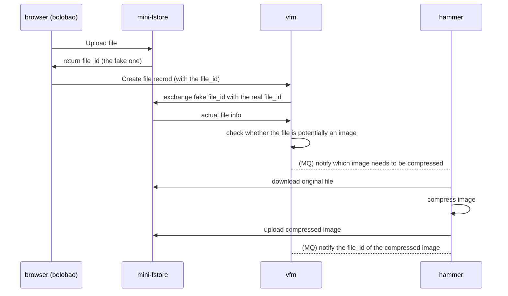

# hammer

Hammer - Simple Image Compression Service

## Requirements

- libvips (see https://github.com/h2non/bimg)

### The Sequence

```mermaid
sequenceDiagram

    participant b as browser (bolobao)
    participant m as mini-fstore
    participant v as vfm
    participant h as hammer

    b->>m:Upload file
    m->>b:return file_id (the fake one)
    b->>v:Create file recrod (with the file_id)
    v->>m:exchange fake file_id with the real file_id
    m->>v:actual file info
    v->>v:check whether the file is potentially an image
    v-->h:(MQ) notify which image needs to be compressed
    h->>m:download original file
    h->>h:compress image
    h->>m:upload compressed image
    h-->v:(MQ) notify the file_id of the compressed image
```