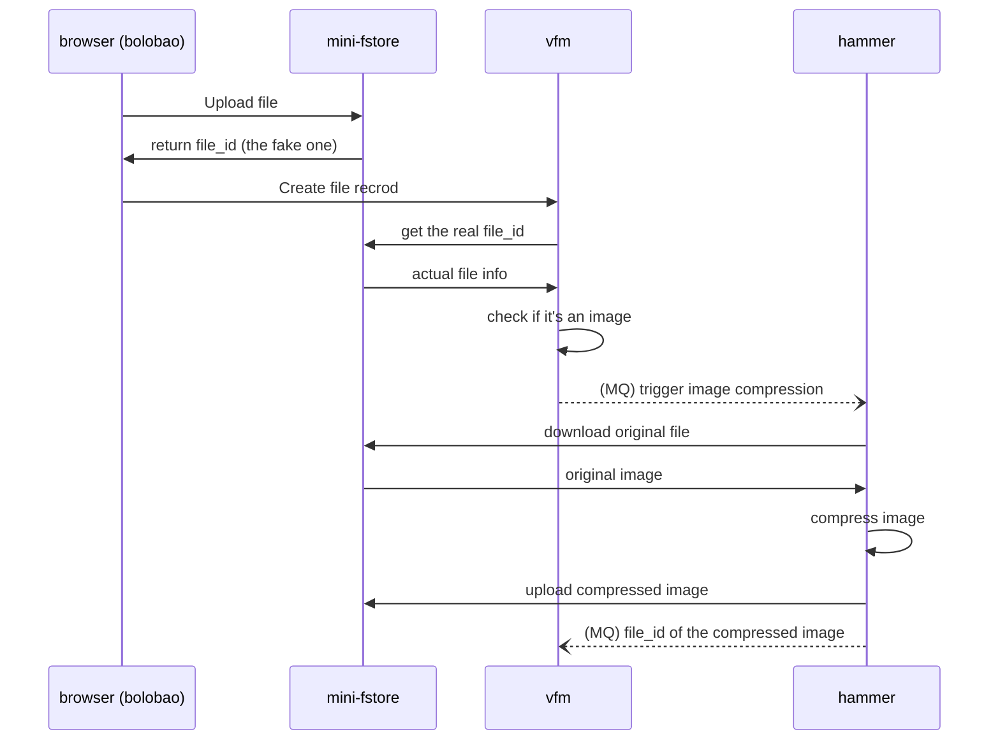

# hammer

Hammer - Simple Image Compression Service.

## Updates

- Since v0.0.5, hammer nolonger uses libvip (external dependency) to compress images. It now uses [github.com/disintegration/gift](github.com/disintegration/gift) instead, it might be slower and more resource intensive, but it's written purely in Go.

## The Sequence

